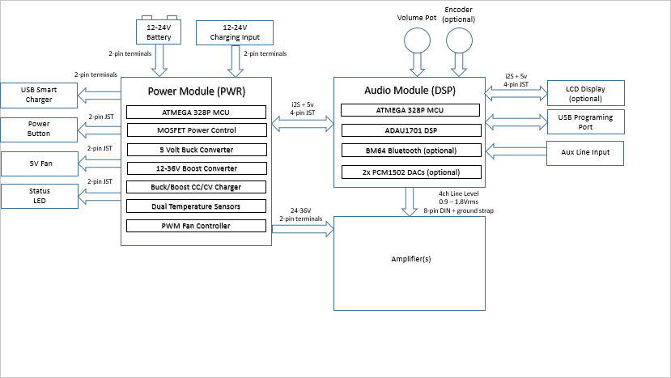

# GhettoDSP
 
GhettoDSP is part of a collection of DIY PCB and MCU codes based around the ADAU1701 DSP chip.

Key components are an Atmega 328p MCU, Microchip BM64 BT module, and ADAU1701 DSP chip.   The BT module can be omitted for minimal/standalone 2x4 or 2x8 DSP operation.

The default audio pipeline is I2S (24-bit, 48khz, 64fs).  Many other combinations are supported through jumpers and DSP config.

In BT or aux-in mode, unlimited number of boards can be paired together for wireless stereo or "party" mode.   This is possible through the Wireless Concert (nSPK) feature of the class 1 BM64 module.

Optional 20x2 or 20x4 I2C LCD module and rotary encoder for DSP and BT settings.

Optional power supply module (GhettoPWR) for buck/boost and battery charge/BMS function.

There are currently four boards (hyperlink to EasyEDA project):

* [GhettoDSP](https://oshwlab.com/k6rp/mega328p-adau1701_copy_copy_copy_copy_copy_copy_copy_copy_copy) - DSP and BT board
* [GhettoDAC](https://oshwlab.com/k6rp/ghettodac-0-1) - Dual PCM1502A daughter card for GhettoDSP provides 4 more channels @ 2V RMS (total 8-ch)
* [GhettoPWR](https://github.com/djamps/GhettoPWR) - Power supply (up to 400 watts boost and buck converters), and BMS for lithium batteries (4-8 cells)
* [HooptyDSP](https://oshwlab.com/k6rp/mega328p-adau1701_copy_copy_copy_copy_copy_copy_copy_copy) - 12 volt version of GhettoDSP with integrated power supply for in-dash mobile/car audio

This Arduino code is provided for GhettoDSP and HooptyDSP boards (specify which in config.h)

Base DSP config is created using SigmaDSP, and is programmed directly by the MCU at power on.  A USBi connector is provided for realtime testing with a Dayton ICP3 (ect.).  

Spare ADC's for both DSP and MCU are exposed.

Documentation is a work in progress.

Special thanks to [MCUDude](https://github.com/MCUdude/SigmaDSP) and [konikoni428](https://github.com/konikoni428/BM64_arduino) for helping make this possible.
